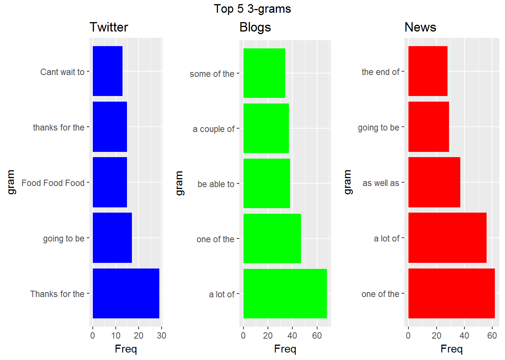
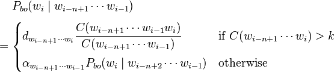
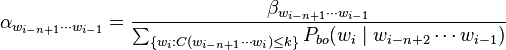
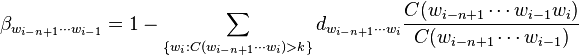
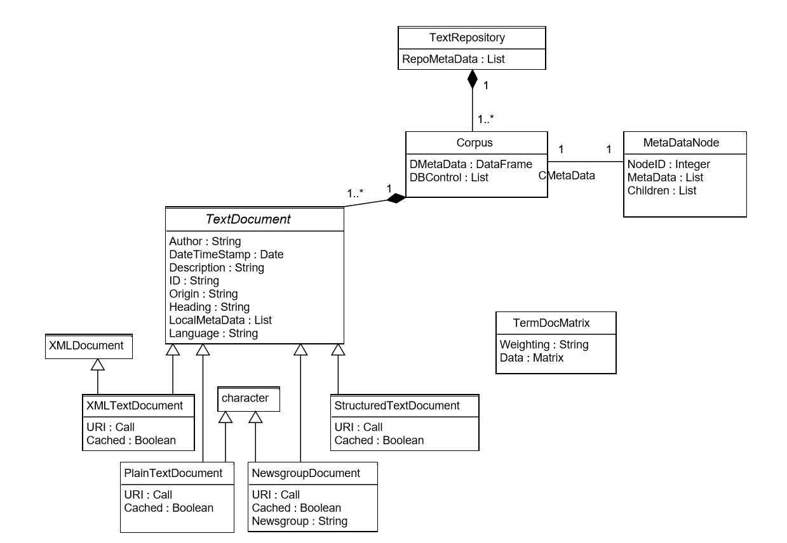
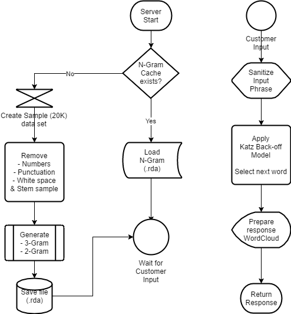

Text prediction algorithm (Shiny App)
========================================================
author: Sri Jawaharlal
date: 6/8/2017
autosize: true

Analyze a large corpus of text documents (provided by SwitKey) to discover the structure in the data, and demonstrate predictive model for text by understanding the distribution and relationship between words.

Final project - John Hopkins Univerisy & coursera.org

N-Gram Aanalysis & Katz Backoff Model
========================================================

<pre>
##   fileName fileSizeMB totLines wordsPerLine charsPerLine charsPerWord
## 1  twitter        159  2360148           13           69            5
## 2    blogs        200   899288           42          232            6
## 3     news        196    77259           35          203            6
</pre>

********

#### Katz equation (from Wikipedia)

<pre>
- d is discounting factor (Good-Turing discount). K is usually 0
- alpha: normalization of the left-over probability
</pre>

<pre>-beta: the left-over probability</pre>

Text mining infrastructure in R 
========================================================

<pre>A detailed understanding of the tm package in R, will go a long way in speeding up building the necessary models & optimizing the solution.</pre>

Source: Journal of Statistical Software, March 2008, Vol 25, Issue 5

Building the model & strategies for performance improvements
========================================================

iWords - Application to demonstrate Text Prediction
========================================================

How to use: <u>[Click](https://jsridhar.shinyapps.io/iWords/)</u> to access the application.

How to see the results: Type the phrase to see the results shown as WordCloud

Improvements: Katz Back-off model is a basic approach to word prediction. There are additional incremental steps such as adding dictionary to improve the preduction over time based on user typing patterns. 
